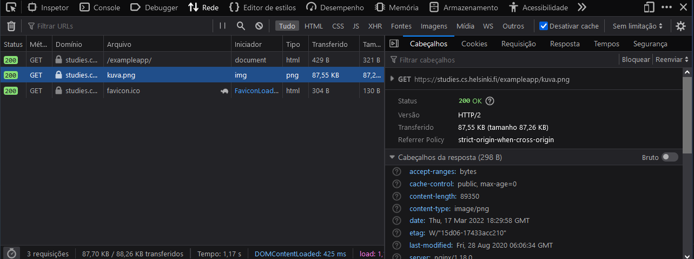
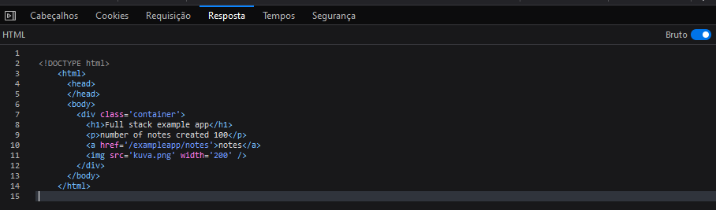
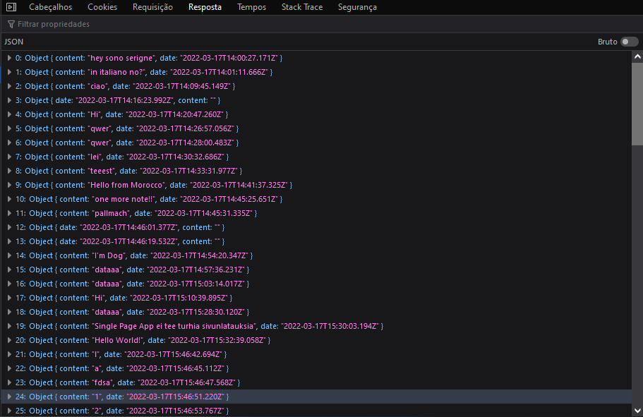

Pedro Henrique Cruz Ubine

# Notas Full Stack Open

## Parte zero.

### HTTP GET

O servidor e o browser se comunicam usando o protocolo **HTTP**(Hypertext Transfer Protocol) que é um protocolo com o foco de transmitir hipermídia documentos como **HTML**.  

Observando o website https://studies.cs.helsinki.fi/exampleapp/  

Quando entramos no website observamos que é feito comando **GET**   


Imagem 1.

É possível ver no cabeçalhos dados como o tamanho e a data em que o arquivo foi transferido,  também é possível ver que na resposta do arquivo /exampleapp/ houve um retorno de um arquivo **UTF=8** sendo que esse arquivo é na verdade o **HTML** da pagina.


Imagem 2.

Olhando a reposta do /exampleapps/ bruto podemos ver o arquivo HTML que o servidor mandou de volta para o browser. Como dentro do HTML também possui uma imagem o browser ao ler o arquivo fara a requisição da imagem sendo ela a "kuva.png".


Imagem 3

A imagem 3 resume as chamadas entre o browser e o servidor.

### Traditional web applications

A pagina estudada até o momento age de maneira tradicional, ou seja quando entramos nela o pegamos o arquivo HTML e mostramos oque o conteúdo do arquivo.
O servidor pode ter formatado o HTML de varias formos *estaticamente*, ou seja o arquivo já estava salvo, ou *dinamicamente*, em que roda um código para formar o arquivo HTML , a da pagina que acessamos funciona dinamicamente pois ele pega a quantidade de notas criada e coloca no arquivo HTML esse valor, como é possível ver no código a seguir:

```html
const getFrontPageHtml = (noteCount) => {
  return(`
    <!DOCTYPE html>
    <html>
      <head>
      </head>
      <body>
        <div class='container'>
          <h1>Full stack example app</h1>
          <p>number of notes created ${noteCount}</p>
          <a href='/notes'>notes</a>
          
        </div>
      </body>
    </html>
`)
} 

app.get('/', (req, res) => {
  const page = getFrontPageHtml(notes.length)
  res.send(page)
})
```


### Running application logic in the browser

Entrando na parte de notes do site (https://studies.cs.helsinki.fi/exampleapp/notes) vemos que o browser faz 4 requisições.
A primeira requisição é o código HTML da pagina:

```html
<!DOCTYPE html>
<html>
<head>
  <link rel="stylesheet" type="text/css" href="/exampleapp/main.css" />
  <script type="text/javascript" src="/exampleapp/main.js"></script>
</head>
<body>
  <div class='container'>
    <h1>Notes</h1>
    <div id='notes'>
    </div>
    <form action='/exampleapp/new_note' method='POST'>
      <input type="text" name="note"><br>
      <input type="submit" value="Save">
    </form>
  </div>
</body>
</html>
```

Comparando o código HTML com a pagina vemos que tem  uma falta de notas escritas por anônimos. Mas é possível ver na parte do HEAD do documento um script de JavaScript sendo ele o main.js que é o terceiro documento retornado pelo servidor.
```javascript
var xhttp = new XMLHttpRequest()
  
xhttp.onreadystatechange = function () {
  if (this.readyState == 4 && this.status == 200) {
    const data = JSON.parse(this.responseText)
    console.log(data)

    var ul = document.createElement('ul')
    ul.setAttribute('class', 'notes')

    data.forEach(function(note){
      var li = document.createElement('li')
      
      ul.appendChild(li);
      li.appendChild(document.createTextNode(note.content))
    })

    document.getElementById("notes").appendChild(ul)
  }
}

xhttp.open("GET", "/exampleapp/data.json", true)
xhttp.send()
```

E observando of fim do código vemos que ele faz um HTTP GET para servidor para pegar o arquivo data.json que onde fica salvo as notas do arquivo.



### Event handlers and Callback functions

```javascript
var xhttp = new XMLHttpRequest()

xhttp.onreadystatechange = function() {
  // code that takes care of the server response
}

xhttp.open('GET', '/data.json', true)
xhttp.send(
```

Observando esse código é possivel perceber que ele é estranho pois o pedido para o servidor se encontra na ultima linha mas o código lida com as reposta antes.
A resposta para essa situação ocorre quando o estado do xhttp muda assim fazendo com que verifique a função:

``` javascript
xhttp.onreadystatechange = function() {
  if (this.readyState == 4 && this.status == 200) {
    // code that takes care of the server response
  }
}
```

Esse mecanismo é chamado de *callback* function , elas são aplicações em que não é o código que invoca a função mas sim o browser , para que ela seja chamada quando o evento ocorra.

### Document Object Moder or DOM

Entendi porra nenhuma
